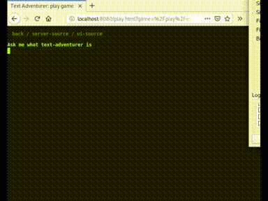

# textadventurer (rust)

An Actix webserver that uses websockets to connect command-line
applications to browsers.



⭐️ [Demo](https://adamkewley.com/textadventurer/index.html)


## Usage

- Create a directory containing games. Each game is a subdirectory
  containing a `textadventure.toml` file (e.g. at
  `games/<game_id>/textadventure.toml`):

```toml
id = "explain-text-adventurer"
name = "Explain Text Adventurer"
description = "A short explanation of text adventurer delivered through the medium of text adventurer."
author = "adamkewley (github)"
application = "python"
args = [ "-u", "game.py",]
```

- Checkout code and run - the repo also contains the web frontend, at
  `static/` (which is why you can't just install it as a rust package):

```bash
git clone https://github.com/adamkewley/ta-rust/
cd ta-rust

# assuming the games dir (described above) is in the parent dir...
cargo run -- ../games/
```

- Open in a browser (e.g. https://localhost:8080)


## Notes

- Currently experimental-grade. Using this as a way of learning about
  interactive browser applications
